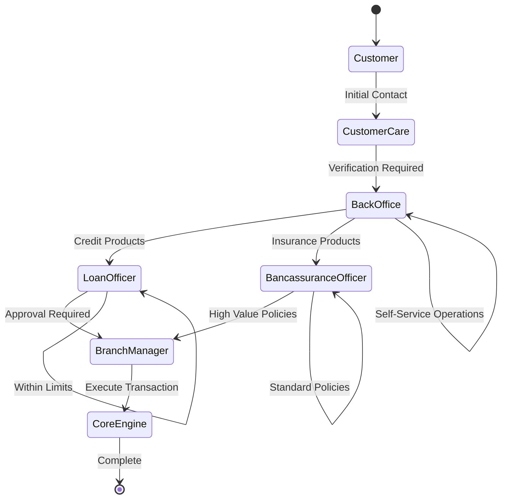

# Design Document: Banking Workflow Roles

## Overview

This design implements three critical banking workflow roles (Back Office Officer, Loan Officer, and Bancassurance Officer) in the MVP4.0 Core Banking System. The solution extends the existing Customer Care Officer functionality with role-based access control, maker-checker workflows, and specialized business logic for each officer type.

The architecture follows a layered approach with clear separation between presentation, business logic, and data layers, ensuring scalability and maintainability while supporting high-volume branch operations typical of Finacle and T24 systems.

## Architecture

### System Architecture


### Role Hierarchy and Workflow



## Components and Interfaces

### Core Components

#### 1. Role-Based Access Control (RBAC) Engine

**Purpose**: Manages user authentication, authorization, and permission enforcement across all officer roles.

**Key Interfaces**:
```typescript
interface IRBACService {
    authenticateUser(credentials: UserCredentials): Promise<AuthResult>
    authorizeAction(userId: string, action: string, resource: string): Promise<boolean>
    getUserPermissions(userId: string): Promise<Permission[]>
    enforceApprovalLimits(userId: string, amount: number, transactionType: string): Promise<ApprovalRequirement>
}

interface Permission {
    resource: string
    actions: string[]
    conditions?: PermissionCondition[]
}

interface ApprovalRequirement {
    requiresApproval: boolean
    approverRole: string
    approvalLimit: number
}
```

#### 2. Maker-Checker Workflow Engine

**Purpose**: Implements two-person authorization processes with audit trails and escalation rules.

**Key Interfaces**:
```typescript
interface IMakerCheckerService {
    initiateMakerAction(action: MakerAction): Promise<WorkflowInstance>
    submitForApproval(workflowId: string, checkerId: string): Promise<ApprovalResult>
    getApprovalQueue(checkerId: string): Promise<PendingApproval[]>
    escalateApproval(workflowId: string, reason: string): Promise<EscalationResult>
}

interface MakerAction {
    actionType: string
    resourceId: string
    data: any
    makerId: string
    businessJustification: string
}

interface WorkflowInstance {
    id: string
    status: WorkflowStatus
    createdAt: Date
    approvalDeadline: Date
    escalationRules: EscalationRule[]
}
```

#### 3. Back Office Officer Services

**Purpose**: Handles account operations, KYC processing, and non-cash transaction management.

**Key Interfaces**:
```typescript
interface IBackOfficeService {
    // Account Operations
    createCustomerAccount(accountData: AccountCreationRequest): Promise<AccountCreationResult>
    verifyAccountOpening(accountId: string, verificationData: VerificationData): Promise<VerificationResult>
    processAccountClosure(accountId: string, closureReason: string): Promise<ClosureResult>
    updateSignatoryRules(accountId: string, signatoryRules: SignatoryRule[]): Promise<UpdateResult>
    
    // KYC & Compliance
    processKYCUpdate(customerId: string, kycData: KYCData): Promise<KYCResult>
    flagHighRiskCustomer(customerId: string, riskIndicators: RiskIndicator[]): Promise<FlagResult>
    escalateAMLViolation(customerId: string, violationDetails: AMLViolation): Promise<EscalationResult>
    
    // Transaction Processing
    postInternalTransfer(transferRequest: InternalTransferRequest): Promise<TransferResult>
    processChargesAndAdjustments(adjustmentRequest: AdjustmentRequest): Promise<AdjustmentResult>
    handleTransactionReversal(reversalRequest: ReversalRequest): Promise<ReversalResult>
}

interface AccountCreationRequest {
    customerId: string
    accountType: string
    initialDeposit: number
    signatoryRules: SignatoryRule[]
    operatingInstructions: string
}

interface KYCData {
    documents: Document[]
    riskRating: RiskRating
    complianceChecks: ComplianceCheck[]
}
```

#### 4. Loan Officer Services

**Purpose**: Manages complete credit lifecycle from origination to recovery within approval limits.

**Key Interfaces**:
```typescript
interface ILoanOfficerService {
    // Loan Origination
    captureLoanApplication(applicationData: LoanApplicationData): Promise<ApplicationResult>
    performCreditScoring(customerId: string, financialData: FinancialData): Promise<CreditScoreResult>
    recommendLoanTerms(applicationId: string, assessment: CreditAssessment): Promise<LoanRecommendation>
    
    // Documentation & Disbursement
    uploadLoanDocuments(loanId: string, documents: Document[]): Promise<DocumentResult>
    initiateDisbursement(loanId: string, disbursementData: DisbursementData): Promise<DisbursementResult>
    
    // Loan Servicing
    processRestructuringRequest(loanId: string, restructureData: RestructureData): Promise<RestructureResult>
    monitorRepaymentSchedule(loanId: string): Promise<RepaymentStatus>
    identifyNPLClassification(loanId: string): Promise<NPLAssessment>
    
    // Collections
    initiateRecoveryAction(loanId: string, recoveryPlan: RecoveryPlan): Promise<RecoveryResult>
}

interface LoanApplicationData {
    customerId: string
    loanAmount: number
    tenure: number
    purpose: string
    collateralDetails: CollateralData[]
    financialStatements: FinancialStatement[]
}

interface CreditScoreResult {
    score: number
    riskGrade: string
    scoringFactors: ScoringFactor[]
    recommendedTerms: LoanTerms
}
```

#### 5. Bancassurance Officer Services

**Purpose**: Manages insurance product sales, servicing, and commission tracking within the banking system.

**Key Interfaces**:
```typescript
interface IBancassuranceService {
    // Insurance Sales
    onboardCustomerForInsurance(customerId: string, policyData: PolicyData): Promise<PolicyResult>
    linkPolicyToBankAccount(policyId: string, accountId: string): Promise<LinkResult>
    
    // Premium Management
    initiatePremiumDebit(policyId: string, premiumAmount: number): Promise<DebitResult>
    setupStandingInstructions(policyId: string, siData: StandingInstructionData): Promise<SIResult>
    trackPolicyStatus(policyId: string): Promise<PolicyStatus>
    
    // Claims Processing
    captureClaimNotification(claimData: ClaimData): Promise<ClaimResult>
    trackClaimProgress(claimId: string): Promise<ClaimStatus>
    
    // Commission & Reporting
    viewCommissionEarned(officerId: string, period: DateRange): Promise<CommissionReport>
    generateBancassuranceReport(reportType: string, parameters: ReportParameters): Promise<Report>
}

interface PolicyData {
    policyType: string
    coverageAmount: number
    premiumAmount: number
    beneficiaries: Beneficiary[]
    linkedAccountId: string
}

interface ClaimData {
    policyId: string
    claimType: string
    claimAmount: number
    supportingDocuments: Document[]
    incidentDate: Date
}
```

## Data Models

### Core Entity Relationships


### Key Data Structures

#### User and Role Management
```sql
-- Users table (extends existing Customer Care structure)
CREATE TABLE Users (
    UserId UNIQUEIDENTIFIER PRIMARY KEY,
    Username NVARCHAR(50) UNIQUE NOT NULL,
    PasswordHash NVARCHAR(255) NOT NULL,
    FullName NVARCHAR(100) NOT NULL,
    Email NVARCHAR(100) NOT NULL,
    IsActive BIT DEFAULT 1,
    CreatedAt DATETIME2 DEFAULT GETDATE(),
    LastLoginAt DATETIME2,
    FailedLoginAttempts INT DEFAULT 0
);

-- Roles table
CREATE TABLE Roles (
    RoleId UNIQUEIDENTIFIER PRIMARY KEY,
    RoleName NVARCHAR(50) UNIQUE NOT NULL,
    Description NVARCHAR(255),
    ApprovalLimit DECIMAL(18,2) DEFAULT 0,
    IsActive BIT DEFAULT 1
);

-- User-Role assignments
CREATE TABLE UserRoles (
    UserRoleId UNIQUEIDENTIFIER PRIMARY KEY,
    UserId UNIQUEIDENTIFIER REFERENCES Users(UserId),
    RoleId UNIQUEIDENTIFIER REFERENCES Roles(RoleId),
    AssignedAt DATETIME2 DEFAULT GETDATE(),
    AssignedBy UNIQUEIDENTIFIER REFERENCES Users(UserId)
);

-- Permissions
CREATE TABLE Permissions (
    PermissionId UNIQUEIDENTIFIER PRIMARY KEY,
    Resource NVARCHAR(100) NOT NULL,
    Action NVARCHAR(50) NOT NULL,
    Conditions NVARCHAR(MAX), -- JSON conditions
    UNIQUE(Resource, Action)
);

-- Role-Permission assignments
CREATE TABLE RolePermissions (
    RolePermissionId UNIQUEIDENTIFIER PRIMARY KEY,
    RoleId UNIQUEIDENTIFIER REFERENCES Roles(RoleId),
    PermissionId UNIQUEIDENTIFIER REFERENCES Permissions(PermissionId)
);
```

#### Account Management
```sql
-- Accounts table (extends existing structure)
CREATE TABLE Accounts (
    AccountId UNIQUEIDENTIFIER PRIMARY KEY,
    AccountNumber NVARCHAR(20) UNIQUE NOT NULL,
    CustomerId UNIQUEIDENTIFIER REFERENCES Customers(CustomerId),
    AccountType NVARCHAR(50) NOT NULL,
    Balance DECIMAL(18,2) DEFAULT 0,
    Status NVARCHAR(20) DEFAULT 'Active',
    OpenedDate DATETIME2 DEFAULT GETDATE(),
    ClosedDate DATETIME2 NULL,
    CreatedBy UNIQUEIDENTIFIER REFERENCES Users(UserId),
    AuthorizedBy UNIQUEIDENTIFIER REFERENCES Users(UserId),
    AuthorizedAt DATETIME2 NULL
);

-- Signatory Rules
CREATE TABLE SignatoryRules (
    RuleId UNIQUEIDENTIFIER PRIMARY KEY,
    AccountId UNIQUEIDENTIFIER REFERENCES Accounts(AccountId),
    SignatoryType NVARCHAR(50) NOT NULL, -- Single, Joint, Either
    MinimumSignatures INT DEFAULT 1,
    MaximumAmount DECIMAL(18,2),
    IsActive BIT DEFAULT 1,
    CreatedAt DATETIME2 DEFAULT GETDATE()
);

-- Account Signatories
CREATE TABLE AccountSignatories (
    SignatoryId UNIQUEIDENTIFIER PRIMARY KEY,
    AccountId UNIQUEIDENTIFIER REFERENCES Accounts(AccountId),
    CustomerId UNIQUEIDENTIFIER REFERENCES Customers(CustomerId),
    SignatoryRole NVARCHAR(50) NOT NULL,
    IsActive BIT DEFAULT 1,
    AddedAt DATETIME2 DEFAULT GETDATE()
);
```

#### Loan Management
```sql
-- Loans table
CREATE TABLE Loans (
    LoanId UNIQUEIDENTIFIER PRIMARY KEY,
    LoanNumber NVARCHAR(20) UNIQUE NOT NULL,
    CustomerId UNIQUEIDENTIFIER REFERENCES Customers(CustomerId),
    LoanType NVARCHAR(50) NOT NULL,
    PrincipalAmount DECIMAL(18,2) NOT NULL,
    InterestRate DECIMAL(5,4) NOT NULL,
    Tenure INT NOT NULL, -- in months
    Status NVARCHAR(20) DEFAULT 'Applied',
    ApplicationDate DATETIME2 DEFAULT GETDATE(),
    ApprovalDate DATETIME2 NULL,
    DisbursementDate DATETIME2 NULL,
    MaturityDate DATETIME2 NULL,
    LoanOfficerId UNIQUEIDENTIFIER REFERENCES Users(UserId),
    ApprovedBy UNIQUEIDENTIFIER REFERENCES Users(UserId)
);

-- Credit Assessments
CREATE TABLE CreditAssessments (
    AssessmentId UNIQUEIDENTIFIER PRIMARY KEY,
    LoanId UNIQUEIDENTIFIER REFERENCES Loans(LoanId),
    CreditScore INT NOT NULL,
    RiskGrade NVARCHAR(10) NOT NULL,
    DebtToIncomeRatio DECIMAL(5,4),
    CollateralValue DECIMAL(18,2),
    AssessmentDate DATETIME2 DEFAULT GETDATE(),
    AssessedBy UNIQUEIDENTIFIER REFERENCES Users(UserId)
);

-- Loan Repayments
CREATE TABLE LoanRepayments (
    RepaymentId UNIQUEIDENTIFIER PRIMARY KEY,
    LoanId UNIQUEIDENTIFIER REFERENCES Loans(LoanId),
    ScheduledDate DATE NOT NULL,
    ScheduledAmount DECIMAL(18,2) NOT NULL,
    PaidDate DATE NULL,
    PaidAmount DECIMAL(18,2) NULL,
    Status NVARCHAR(20) DEFAULT 'Scheduled',
    CreatedAt DATETIME2 DEFAULT GETDATE()
);

-- Collateral
CREATE TABLE Collateral (
    CollateralId UNIQUEIDENTIFIER PRIMARY KEY,
    LoanId UNIQUEIDENTIFIER REFERENCES Loans(LoanId),
    CollateralType NVARCHAR(50) NOT NULL,
    Description NVARCHAR(255),
    EstimatedValue DECIMAL(18,2) NOT NULL,
    ValuationDate DATE NOT NULL,
    IsActive BIT DEFAULT 1
);
```

#### Insurance/Bancassurance Management
```sql
-- Insurance Policies
CREATE TABLE InsurancePolicies (
    PolicyId UNIQUEIDENTIFIER PRIMARY KEY,
    PolicyNumber NVARCHAR(20) UNIQUE NOT NULL,
    CustomerId UNIQUEIDENTIFIER REFERENCES Customers(CustomerId),
    PolicyType NVARCHAR(50) NOT NULL,
    CoverageAmount DECIMAL(18,2) NOT NULL,
    PremiumAmount DECIMAL(18,2) NOT NULL,
    PremiumFrequency NVARCHAR(20) NOT NULL, -- Monthly, Quarterly, Annual
    LinkedAccountId UNIQUEIDENTIFIER REFERENCES Accounts(AccountId),
    Status NVARCHAR(20) DEFAULT 'Active',
    StartDate DATE NOT NULL,
    EndDate DATE NOT NULL,
    BancassuranceOfficerId UNIQUEIDENTIFIER REFERENCES Users(UserId),
    CreatedAt DATETIME2 DEFAULT GETDATE()
);

-- Policy Beneficiaries
CREATE TABLE PolicyBeneficiaries (
    BeneficiaryId UNIQUEIDENTIFIER PRIMARY KEY,
    PolicyId UNIQUEIDENTIFIER REFERENCES InsurancePolicies(PolicyId),
    BeneficiaryName NVARCHAR(100) NOT NULL,
    Relationship NVARCHAR(50) NOT NULL,
    BenefitPercentage DECIMAL(5,2) NOT NULL,
    IsActive BIT DEFAULT 1
);

-- Premium Payments
CREATE TABLE PremiumPayments (
    PaymentId UNIQUEIDENTIFIER PRIMARY KEY,
    PolicyId UNIQUEIDENTIFIER REFERENCES InsurancePolicies(PolicyId),
    ScheduledDate DATE NOT NULL,
    ScheduledAmount DECIMAL(18,2) NOT NULL,
    PaidDate DATE NULL,
    PaidAmount DECIMAL(18,2) NULL,
    Status NVARCHAR(20) DEFAULT 'Scheduled',
    TransactionId UNIQUEIDENTIFIER REFERENCES Transactions(TransactionId) NULL
);

-- Insurance Claims
CREATE TABLE InsuranceClaims (
    ClaimId UNIQUEIDENTIFIER PRIMARY KEY,
    ClaimNumber NVARCHAR(20) UNIQUE NOT NULL,
    PolicyId UNIQUEIDENTIFIER REFERENCES InsurancePolicies(PolicyId),
    ClaimType NVARCHAR(50) NOT NULL,
    ClaimAmount DECIMAL(18,2) NOT NULL,
    IncidentDate DATE NOT NULL,
    ClaimDate DATE DEFAULT GETDATE(),
    Status NVARCHAR(20) DEFAULT 'Submitted',
    ProcessedBy UNIQUEIDENTIFIER REFERENCES Users(UserId),
    ProcessedAt DATETIME2 NULL
);
```

#### Workflow and Audit Management
```sql
-- Workflow Instances
CREATE TABLE WorkflowInstances (
    WorkflowId UNIQUEIDENTIFIER PRIMARY KEY,
    WorkflowType NVARCHAR(50) NOT NULL,
    ResourceId UNIQUEIDENTIFIER NOT NULL,
    ResourceType NVARCHAR(50) NOT NULL,
    Status NVARCHAR(20) DEFAULT 'Pending',
    InitiatedBy UNIQUEIDENTIFIER REFERENCES Users(UserId),
    InitiatedAt DATETIME2 DEFAULT GETDATE(),
    CompletedAt DATETIME2 NULL,
    Data NVARCHAR(MAX) -- JSON data
);

-- Approval Steps
CREATE TABLE ApprovalSteps (
    StepId UNIQUEIDENTIFIER PRIMARY KEY,
    WorkflowId UNIQUEIDENTIFIER REFERENCES WorkflowInstances(WorkflowId),
    StepOrder INT NOT NULL,
    ApproverRole NVARCHAR(50) NOT NULL,
    AssignedTo UNIQUEIDENTIFIER REFERENCES Users(UserId) NULL,
    Status NVARCHAR(20) DEFAULT 'Pending',
    ApprovedAt DATETIME2 NULL,
    Comments NVARCHAR(500) NULL
);

-- Audit Logs
CREATE TABLE AuditLogs (
    AuditId UNIQUEIDENTIFIER PRIMARY KEY,
    UserId UNIQUEIDENTIFIER REFERENCES Users(UserId),
    Action NVARCHAR(100) NOT NULL,
    ResourceType NVARCHAR(50) NOT NULL,
    ResourceId UNIQUEIDENTIFIER NOT NULL,
    OldValues NVARCHAR(MAX), -- JSON
    NewValues NVARCHAR(MAX), -- JSON
    IPAddress NVARCHAR(45),
    UserAgent NVARCHAR(255),
    Timestamp DATETIME2 DEFAULT GETDATE()
);
```

## Correctness Properties

*A property is a characteristic or behavior that should hold true across all valid executions of a system—essentially, a formal statement about what the system should do. Properties serve as the bridge between human-readable specifications and machine-verifiable correctness guarantees.*

Before defining the correctness properties, I need to analyze the acceptance criteria from the requirements to determine which ones are testable as properties.

### Property-Based Testing Properties

Based on the prework analysis and property reflection, the following consolidated properties ensure system correctness:

**Property 1: Role-Based Access Control Enforcement**
*For any* user and any system action, the system should only allow the action if the user's role has the required permissions, and should deny and log any unauthorized access attempts
**Validates: Requirements 1.6, 2.4, 3.5, 4.5, 5.5, 6.5, 7.1, 7.2**

**Property 2: Maker-Checker Workflow Integrity**
*For any* high-risk transaction or policy change, the system should enforce that different users perform the maker and checker functions, and should escalate when approval limits are exceeded
**Validates: Requirements 1.5, 3.3, 4.4, 5.2, 5.4, 7.3, 7.4**

**Property 3: Data Validation and Business Rules**
*For any* data input or business operation, the system should validate all required information according to business rules and prevent operations that violate policy constraints
**Validates: Requirements 1.1, 1.2, 1.3, 2.1, 2.5, 3.1, 3.2, 4.1, 4.2, 4.3, 5.1, 6.1, 6.2**

**Property 4: Workflow Routing and Handoffs**
*For any* workflow transition between roles, the system should route work items to appropriate officers with proper context and maintain status visibility throughout the process
**Validates: Requirements 8.1, 8.2, 8.3, 8.4**

**Property 5: Audit Trail Completeness**
*For any* user action or system operation, the system should capture complete audit trails with timestamps, user identification, and relevant context data
**Validates: Requirements 2.2, 3.3, 7.5, 8.5**

**Property 6: Automated Monitoring and Alerts**
*For any* time-sensitive business event (policy renewals, loan payments, risk flags), the system should generate appropriate alerts and trigger required workflows
**Validates: Requirements 2.3, 4.6, 5.3, 6.3**

**Property 7: External System Integration**
*For any* operation requiring external data or services, the system should properly integrate with external APIs while maintaining data consistency and error handling
**Validates: Requirements 9.1, 9.2, 9.3**

**Property 8: Comprehensive Reporting**
*For any* reporting request, the system should compile accurate data from all relevant sources and present it according to the specified report type and parameters
**Validates: Requirements 6.6, 9.4, 10.1, 10.2, 10.3, 10.4, 10.5**

**Property 9: Document Management and Tracking**
*For any* document upload or management operation, the system should store documents securely, validate document types, track expiry dates, and maintain proper linkages
**Validates: Requirements 5.1, 6.4**

**Property 10: Standing Instructions and Scheduled Operations**
*For any* scheduled operation or standing instruction, the system should execute according to defined rules and schedules while maintaining proper validation and audit trails
**Validates: Requirements 3.4, 6.2**

## Error Handling

### Error Categories and Handling Strategies

#### 1. Authentication and Authorization Errors
- **Invalid Credentials**: Return generic error message, log attempt, implement lockout after failed attempts
- **Insufficient Permissions**: Deny access, log attempt, provide clear error message about required permissions
- **Session Expiry**: Force re-authentication, preserve work in progress where possible

#### 2. Business Rule Violations
- **Policy Violations**: Prevent action, provide clear explanation of violated rule, suggest escalation path
- **Data Validation Errors**: Return specific field-level errors, maintain data integrity
- **Approval Limit Exceeded**: Route to appropriate approver, notify user of escalation

#### 3. External System Integration Errors
- **Credit Bureau API Failures**: Implement retry logic, fallback to manual assessment, log for follow-up
- **Insurance Partner API Failures**: Queue operations for retry, notify relevant officers
- **Network Timeouts**: Implement circuit breaker pattern, provide user feedback

#### 4. Database and System Errors
- **Database Connection Failures**: Implement connection pooling and retry logic
- **Transaction Failures**: Implement proper rollback mechanisms, maintain data consistency
- **Concurrency Conflicts**: Implement optimistic locking, provide conflict resolution options

#### 5. Workflow and Process Errors
- **Workflow State Inconsistencies**: Implement state validation, provide recovery mechanisms
- **Approval Timeout**: Implement escalation rules, notify relevant parties
- **Document Processing Errors**: Quarantine problematic documents, notify users

### Error Recovery Mechanisms

```typescript
interface ErrorRecoveryStrategy {
    errorType: string
    retryPolicy: RetryPolicy
    fallbackAction: FallbackAction
    notificationRules: NotificationRule[]
}

interface RetryPolicy {
    maxAttempts: number
    backoffStrategy: 'exponential' | 'linear' | 'fixed'
    baseDelay: number
}

interface FallbackAction {
    actionType: 'manual_intervention' | 'alternative_workflow' | 'queue_for_later'
    parameters: any
}
```

## Testing Strategy

### Dual Testing Approach

The testing strategy employs both unit testing and property-based testing to ensure comprehensive coverage:

**Unit Testing Focus:**
- Specific business scenarios and edge cases
- Integration points between components
- Error conditions and exception handling
- Mock external system responses
- Database transaction integrity

**Property-Based Testing Focus:**
- Universal properties across all valid inputs
- Role-based access control enforcement
- Workflow integrity and state transitions
- Data validation and business rule compliance
- Audit trail completeness

### Property-Based Testing Configuration

**Testing Framework**: Use QuickCheck for .NET (FsCheck) or Hypothesis for Python
**Test Configuration**:
- Minimum 100 iterations per property test
- Custom generators for banking domain objects (accounts, loans, policies)
- Shrinking strategies for complex business objects
- Parallel test execution where possible

**Property Test Tags**:
Each property test must include a comment referencing its design document property:
```csharp
[Property]
[Tag("Feature: banking-workflow-roles, Property 1: Role-Based Access Control Enforcement")]
public void RoleBasedAccessControlEnforcement(User user, SystemAction action)
{
    // Test implementation
}
```

### Test Data Management

**Test Data Strategy**:
- Use in-memory databases for unit tests
- Implement test data builders for complex domain objects
- Create realistic test scenarios based on actual banking operations
- Maintain separate test databases for integration testing

**Data Generators**:
```typescript
interface TestDataGenerators {
    generateUser(role: UserRole): User
    generateAccount(accountType: AccountType): Account
    generateLoan(loanType: LoanType): Loan
    generatePolicy(policyType: PolicyType): InsurancePolicy
    generateTransaction(transactionType: TransactionType): Transaction
}
```

### Integration Testing

**External System Mocking**:
- Mock credit bureau APIs with realistic response patterns
- Mock insurance partner APIs with various success/failure scenarios
- Simulate network delays and timeouts
- Test circuit breaker and retry mechanisms

**Database Integration**:
- Test transaction rollback scenarios
- Verify audit trail generation
- Test concurrent access patterns
- Validate data consistency across related entities

### Performance Testing

**Load Testing Scenarios**:
- High-volume transaction processing
- Concurrent user access patterns
- Batch processing operations
- Report generation under load

**Performance Benchmarks**:
- Account creation: < 2 seconds
- Loan application processing: < 5 seconds
- Transaction posting: < 1 second
- Report generation: < 30 seconds for standard reports

### Compliance and Security Testing

**Security Testing**:
- SQL injection prevention
- Cross-site scripting (XSS) protection
- Authentication bypass attempts
- Authorization escalation attempts

**Compliance Testing**:
- Audit trail completeness verification
- Data retention policy compliance
- Regulatory reporting accuracy
- Privacy protection validation